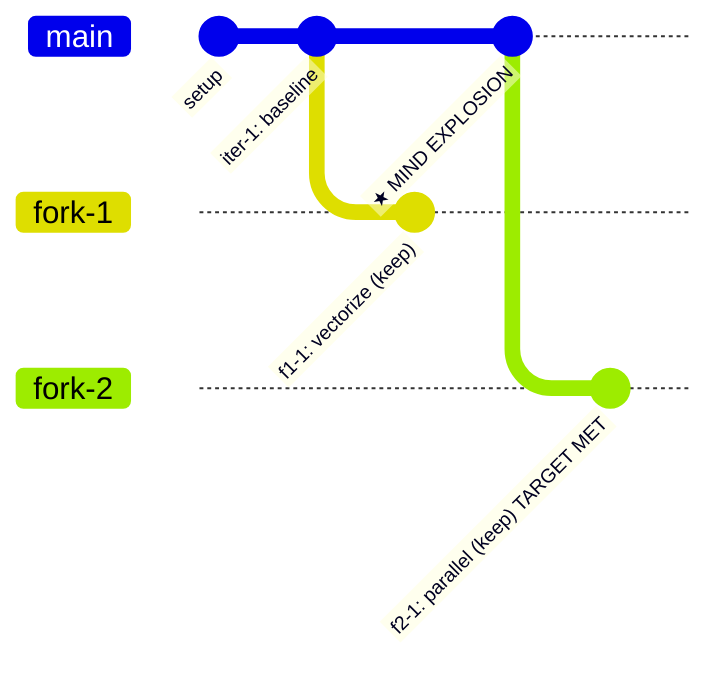

# Reference: Branching & Multi-Path Exploration

## Overview

autoresearch-x v2 supports **multi-path BFS exploration** via checkpoint-and-fork branching. Instead of a single linear chain of iterations, the system can explore multiple strategies in parallel (via sequential priority-based rotation), branch at decision points, and trigger a Strategist agent (mind explosion) when all branches stall.

## Branch Model

Each strategy is a **git branch** forked from a **checkpoint** (a git tag). The run starts with a single `main` branch. Forks are created when the main agent identifies genuinely different strategies during REVIEW & PLAN.

```
autoresearch-x/<tag>                    ← main branch
  ├── checkpoint/cp-001                 ← decision point (git tag)
  │   ├── autoresearch-x/<tag>/fork-1   ← strategy A
  │   └── autoresearch-x/<tag>/fork-2   ← strategy B
  └── checkpoint/cp-002
      └── autoresearch-x/<tag>/fork-1a  ← sub-strategy of fork-1
```

## Tracking Files

```
.autoresearch-x/<tag>/
  ├── branches.tsv          # Branch registry (status, priority, metrics)
  ├── all-results.tsv       # Consolidated cross-branch results
  ├── branches/
  │   ├── main/
  │   │   ├── results.tsv   # Per-branch iteration results
  │   │   └── iterations/   # Per-branch iteration details
  │   ├── fork-1/
  │   │   ├── results.tsv
  │   │   └── iterations/
  │   └── ...
  └── strategist/
      ├── explosion-001.yaml
      └── research-notes/
```

### branches.tsv — Branch Registry

Tab-separated. New branches appended; existing rows updated in-place.

```
branch_id	parent_checkpoint	status	priority	iterations	best_metric	stall_count	created_at
main	-	active	0.8	5	42.3	0	2026-03-30T10:00:00
fork-1	cp-001	suspended	0.6	3	41.1	2	2026-03-30T11:30:00
```

**Statuses:** `active`, `suspended`, `stalled`, `completed`, `pruned`

### all-results.tsv — Cross-Branch Consolidated Results

Same columns as per-branch `results.tsv`, plus a `branch_id` column prepended. Rebuilt automatically by merging all `branches/*/results.tsv` files.

## Outer Loop (Branch Manager)

The Branch Manager wraps the existing 9-step inner loop:

```
1. READ branches.tsv → compute priorities
2. SELECT highest-priority non-stalled branch
3. SWITCH to that branch:
   a. Clean working tree check (git stash if dirty)
   b. git checkout autoresearch-x/<tag>/<branch_id>
   c. bash ${CLAUDE_PLUGIN_ROOT}/hooks/run-control.sh switch-branch <branch_id>
4. RUN inner loop for K iterations (default K=3)
   - Worker receives cross-branch summary
   - Early exit on 5 consecutive discards (branch marked stalled)
   - Fork candidates recorded in pending_forks (deferred)
5. UPDATE branches.tsv (priority, metrics, stall_count)
6. CREATE PENDING FORKS (deferred from inner Step 1)
7. CHECK GLOBAL STALL → trigger Strategist if all stalled
8. CHECK COMPLETION → stop if target met or budget exhausted
9. GOTO 1
```

## Priority Scoring

Recomputed after each branch visit:

```
priority = improvement_rate * 0.5 + freshness * 0.3 + proximity * 0.2
```

- `improvement_rate` — metric delta over last 3 iterations, normalized [0,1]. Direction from program.md target comparison operator: `<`/`<=` = lower-is-better, `>`/`>=` = higher-is-better.
- `freshness` — `1 - (stall_count / 5)`, clamped [0,1]
- `proximity` — `1 - (|current - target| / |baseline - target|)`, clamped [0,1]. If baseline == target: 1.0.

## Fork Conditions

Forks are **deferred** — recorded during inner Step 1 (REVIEW & PLAN), created in outer Step 6.

**When to fork:**
- Main agent identifies 2+ genuinely different root approaches (not parameter variations)
- "vectorize" vs "parallelize" = valid fork
- "buffer 128KB" vs "buffer 256KB" = NOT a valid fork (parameter variation)
- Must articulate why each fork is distinct

**Fork creation:**
```bash
git tag checkpoint/cp-NNN <commit_hash>
git checkout -b autoresearch-x/<tag>/<fork-name> checkpoint/cp-NNN
mkdir -p .autoresearch-x/<tag>/branches/<fork-name>/iterations
# Write TSV header to branches/<fork-name>/results.tsv
git checkout autoresearch-x/<tag>/<current_branch>
# Update branches.tsv: add row with status=suspended
```

**Limits:**
- Max 8 concurrent non-pruned branches
- Max 3 levels of fork depth

## Branch Stall Detection

A branch is stalled when it accumulates **5 consecutive discards** within its own `results.tsv` (not counting inherited parent iterations).

On stall:
1. Inner loop exits early
2. Status → `stalled` in branches.tsv
3. Priority drops (freshness → 0)
4. Skipped by priority queue

The v1 Stuck Protocol is **replaced** by branch stall detection. No within-branch recovery attempts — recovery happens at the outer loop level.

## Cross-Branch Context

When dispatching a Worker on any branch, include a cross-branch summary from `all-results.tsv`:

```markdown
## Cross-Branch Context (read-only)
- branch/main: tried loop unrolling (keep, 42.3), prefetching (discard)
- branch/fork-2: DP rewrite failed (discard, 38.2) — worse than baseline
```

Workers see summaries only — prevents redundant exploration across branches.

## Mind Explosion (Strategist)

**Trigger:** ALL branches with status not in {completed, pruned} are stalled.

**Dispatch:**
```
Agent(
  subagent_type="autoresearch-x:strategist",
  description="mind explosion N",
  prompt="
    ## All Results (cross-branch)
    <all-results.tsv content>

    ## Iteration Details (stalled branches)
    <all iterations/<commit>.md from stalled branches>

    ## Current Program
    <program.md content>

    ## Branch Registry
    <branches.tsv content>

    ## Project Root
    <working directory>
  "
)
```

**Output:** `strategist/explosion-NNN.yaml` containing goal re-examination, failure patterns, new strategies, fork point, and optional program revision.

**The 5-Round Protocol:** The Strategist follows a structured brainstorming process:
- **Round 0: RE-EXAMINE THE GOAL** — Before analyzing failures, question whether the goal, scope, and metric are still right. Uses 5 Whys to find the real problem. Checks for the "marginal traction trap" (small improvements that create the illusion of progress while proving a ceiling).
- **Round 1: DIVERGE** — Generate 5-7 raw ideas with external research. Each idea gets a "warmth check" — does it build on what we learned (warm) or ignore it (cold)?
- **Round 2: CRITIQUE** — Self-challenge each idea. Narrow-deep drill into the weakest assumption of each. Score on novelty, evidence, feasibility, and warmth.
- **Round 3: CONVERGE** — Select top 2-3, define concrete steps, expected signals (visible within 2-3 iterations), and aggressive kill criteria.
- **Round 4: ADVERSARIAL CHECK** — Simple-explanation test, repackaging test, assumption audit, metric sanity check.

**Program revision gate:** If the Strategist proposes program changes:
1. Dispatch **reviewer** subagent on the revised draft (same validation as setup)
2. Present reviewer-validated draft to **user** for approval (human gate)
3. On approve: archive current as `program.vN.md`, write new `program.md`

**Fork point selection:**
1. Primary: checkpoint whose descendant achieved the best metric before stalling
2. Tie-breaker: most recent checkpoint
3. Regression fallback: if ALL branches regressed from baseline, fork from original HEAD
4. Strategist override: Strategist can recommend a specific checkpoint with rationale

**Limits:** Max 3 mind explosions per run.

## Program Versioning

When `program.md` is revised (by Strategist + human approval):
- Current version archived as `program.v<N>.md`
- New version written to `program.md`
- `## Reviewed: PASS` marker re-added after reviewer validation

## Backward Compatibility

If no forks are created, v2 behaves identically to v1:
- `branches.tsv` has only a `main` row
- `branches/main/results.tsv` is the only results file
- No strategist invocations
- Outer loop reduces to: select main → run K iterations → check stall → repeat

## Gitgraph Visualization

Auto-generated in `report.md` from `branches.tsv` + `all-results.tsv`:



Include in report.md after each outer loop iteration that creates or completes branches.
