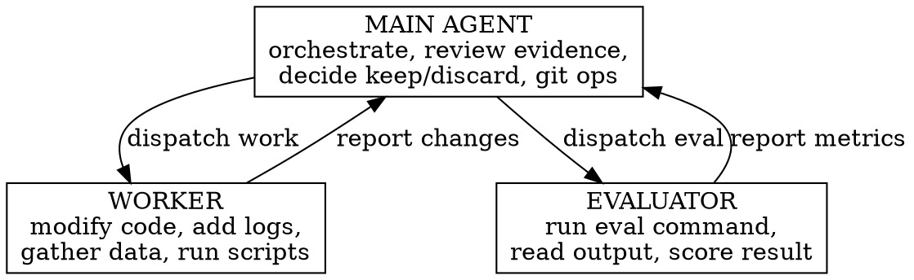

# Reference: Tracking System & Git Operations

## results.tsv — The Index

Append-only, tab-separated. One row per action.

```
timestamp	commit	phase	status	evidence	hypotheses	metric	result	description
```

| Column | Purpose | Example |
|---|---|---|
| `timestamp` | ISO 8601 — MUST be read from tool (`date --iso-8601=seconds` via Bash), never written manually | `2026-03-23T10:01:00` |
| `commit` | Short hash (7 chars) | `a1b2c3d` |
| `phase` | Current phase | baseline, iterate, observe, diagnose, fix, gather, analyze, conclude |
| `status` | Outcome | keep, discard, crash |
| `evidence` | Cited commit refs | `a1b,b2c` or `-` |
| `hypotheses` | Matrix state | `H1:++,H2:--,H3:?` or `-` |
| `metric` | Metric value | `0.991` or `-` |
| `result` | Short outcome summary | `403 still appears`, `test passes`, `latency 189ms` |
| `description` | What was done | `added request logging to handler.py` |

The `result` column captures what happened AFTER the action (the effect), while `description` captures what was done (the cause).

## iterations/ — The Detail

Every iteration gets a `<commit>.md` file. Format adapts to the phase:

**observe/gather:** Changes + Output Observed + Raw Logs (truncated)
**diagnose/analyze:** Toulmin structure (Grounds, Warrant, Qualifier, Rebuttal, Verdict)
**fix/iterate:** Changes + Eval Result + Conclusion
**conclude:** Finding + Evidence Chain + Confidence

## report.md

Auto-generated after each iteration using the mode-specific report template:

| Mode | Template |
|---|---|
| optimize | `templates/report-optimize.md` |
| debug | `templates/report-debug.md` |
| investigate | `templates/report-investigate.md` |

**Required sections (all modes):**
- Run metadata: branch, started, last updated, target, status
- Performance/results table: baseline vs current, delta %, p95
- Benchmark methodology: how each scenario runs, what each metric means, composite formula
- Target status: per-check pass/fail table
- Iteration log: `#, timestamp, commit, status, metric, description`

**Timestamp rule:** Always use `date --iso-8601=seconds` (Bash tool) for timestamps.
Never write timestamps manually — they will be wrong.

**Optimize-specific additions:**
- Profiling findings table (run cProfile early — before assuming the bottleneck)
- Optimizations applied table: commit, change, before, after, delta

**Debug-specific additions:**
- Hypothesis matrix with evidence-for / evidence-against columns
- Root cause section with evidence chain

**Investigate-specific additions:**
- Checklist table with per-item status and one-line answer
- Key findings table with confidence levels
- Evidence chain with Toulmin structure

## Runtime Artifacts

```
.autoresearch-x/<run-tag>/
├── program.md              # Target definition
├── results.tsv             # Index: one-liner per iteration
├── report.md               # Auto-generated summary
├── matrix.md               # ACH hypothesis evidence matrix
├── iterations/             # Per-commit detail files
│   ├── a1b2c3d.md
│   ├── b2c3d4e.md
│   └── ...
└── .gitignore              # Contains !* (survives git clean)
```

## Agent Architecture

Three-tier separation prevents confirmation bias.



**Separation of concerns:**
- **Worker** sees: program.md, target code, logs, data. Does NOT see: evaluation results.
- **Evaluator** sees: eval command, test output, metrics. Does NOT see: code changes.
- **Main** sees everything. Reviews both sides. Makes keep/discard decisions.

**Dispatch:** subagents are defined as plugin agents in `agents/worker.md` and `agents/evaluator.md`. Dispatch them using the Agent tool with `subagent_type: "autoresearch-x:worker"` or `subagent_type: "autoresearch-x:evaluator"`.

## Metric Extraction

Three methods in priority order:

1. **Explicit `extract` command** — if program.md provides one, run it, parse output as number.
2. **Grep pattern** — match `<metric>: <value>` or `<metric>=<value>` in eval output.
3. **LLM extraction** — Evaluator reads stdout and extracts the value. Logged with `extraction_method: llm`.

Supported comparison operators: `<`, `>`, `<=`, `>=`, `==`, `!=`

Error handling:
- Non-numeric output: log as `crash`, retry once, then discard
- Missing metric: log as `crash` with "metric not found in output"
- Multiple values: use last occurrence (common for per-step training output)

## Git Operations

### Branch & Scope

Each run creates `autoresearch-x/<tag>` from current HEAD. Commits only stage scoped files. Reset on discard only reverts scoped files via `git checkout <prev> -- <files>`.

When scope is omitted: before each commit, review `git diff --name-only`, stage only actually-modified files. On discard, revert only those files.

### Progressive Scope Enforcement (Debug)

Advisory — the Main agent reviews diffs before committing. If Worker modifies logic during OBSERVE, Main rejects the commit, instructs Worker to revert, and logs as `discard` with description "out-of-phase change rejected."

### Tracking Survival

`.autoresearch-x/` is untracked and gitignored. `git reset --hard` never affects it. Internal `.gitignore` with `!*` guards against `git clean -fd`.
